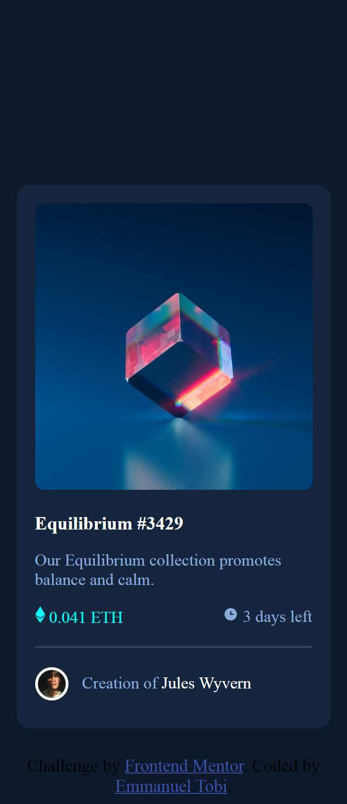

# NFT preview card component solution

This is a solution to the [NFT preview card component challenge on Frontend Mentor](https://www.frontendmentor.io/challenges/nft-preview-card-component-SbdUL_w0U).
I worked really hard in order to finish this challenge

## Overview

### The challenge

Users should be able to:

- View the optimal layout depending on their device's screen size
- See hover states for interactive elements

### Screenshot



### Links

- Solution URL: [Github](https://your-solution-url.com)
- Live Site URL: [Vercel.app](https://your-live-site-url.com)

## My process

### Built with

- Semantic HTML 5 Markup
- CSS
- CSS Pseudo classes
- CSS flex-box

### What I learned

While completeing this project i learnt how to use relationship selectors.
I used an immediate child selector in this css

```
.main-img:active .modal > .modal-img{
    background-image: url(images/icon-view.svg);
    background-size: cover;
    height: 100px;
    width: 100px;
    margin: 100px auto 0px;
    display: block;
}
```

### Continued development

I will start focusing more on more pseudo class elements, in order to get better

## Author

- Emmanuel Tobi
- Frontend Mentor - [@Emmanuel Tobi](https://www.frontendmentor.io/profile/Camoscript)
- Twitter - [@Camoscript](https://www.twitter.com/camoscript1)
